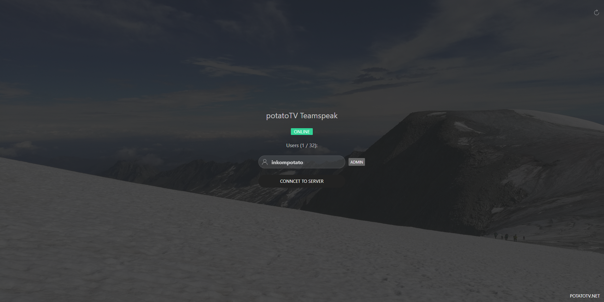

# teamspeak-statuspage
This application will show a simple status page of any Teamspeak Server.
## Requirements
* Webserver running node.js
* Teamspeak 3 Server with Admin Access

If you do not have a server query login yet, follow this guide:

https://www.teamspeak3.com/support/teamspeak-3-add-server-query-user.php

## Setup
1. run `npm i` to install required modules (express, dotenv, ejs, ts3-nodejs-library)
2. configure environment variables
        rename `.env.example` to `.env` and configure the environment variables, explanation below:

````
APP_PORT=[PORT THE APP WILL RUN ON]
PAGE_TITLE=[NAME OF THE STATUSPAGE]
PAGE_LINK=[LINK IN BOTTOM RIGHT CORNER]
PAGE_LINK_TEXT=[VISIBLE TEXT FOR BOTTOM RIGHT LINK]

TS_HOST=[IP-ADDRESS OR HOSTNAME OF TS3 SERVER]
TS_QUERY_PORT=[DEFAULT: 10011]
TS_SERVER_PORT=[DEFAULT: 9987]
TS_USERNAME=[SERVER QUERY USERNAME]
TS_PASSWORD=[SERVER QUERY PASSWORD]
TS_NICKNAME=[SERVER QUERY NICKNAME]
TS_ADMINGROUP=[ADMIN SERVER GROUP ID]
````


3. start application with `npm start`

## About


The `app.js` connects to the TS3 Server on application start and refreshes the list of connected clients on each user request, but only if the requests are more than 5 seconds apart from each other. The page will display an offline badge when the server is not available. All private data is handled by environment variables, allowing for easy customization.

The view `index.ejs` will be generated using ejs.

The website uses UIkit 3.2 and fetches the required files via the official CDN.

## Links
* UIkit: https://getuikit.com
* TS3-NodeJS-Library: https://npmjs.com/package/ts3-nodejs-library
* Express: https://www.npmjs.com/package/express
* DotEnv: https://www.npmjs.com/package/dotenv
* EJS: https://ejs.co

## Licenses
The code is licensed under the MIT license, see [here](LICENSE).

Included images are licensed under CreativeCommons Attribution-NonCommercial 4.0 International (CC-BY-NC)
